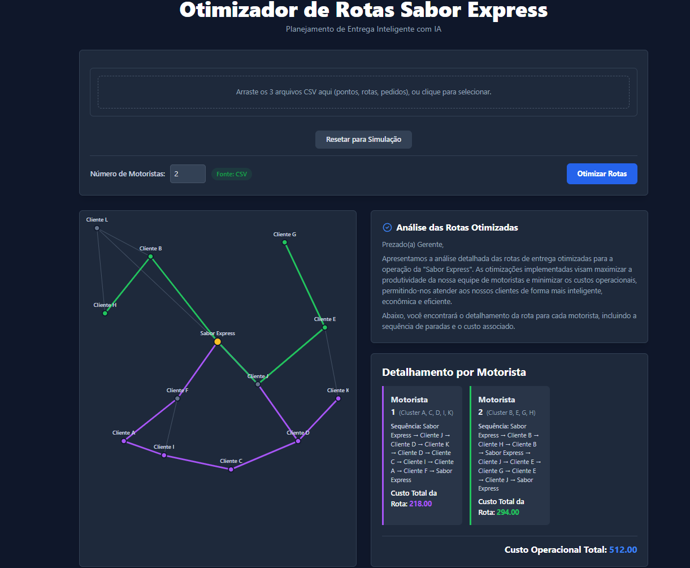

# Rota Inteligente

**Trabalho acadêmico — UniFECAF · Caso Sabor Express**  
*Artificial Intelligence Fundamentals*

[](https://react.dev/)
[](https://www.typescriptlang.org/)
[](https://tailwindcss.com/)
[](https://vitejs.dev/)

---

## 📌 Sobre o Projeto

O **Rota Inteligente** é uma aplicação **SPA (Single Page Application)** que otimiza rotas de entrega **inteiramente no navegador**, sem necessidade de backend.

Inspirado no cenário logístico da **Sabor Express**, o sistema modela a cidade como um grafo e combina duas técnicas clássicas de Inteligência Artificial:

| Algoritmo | Papel na solução |
| --- | --- |
| **K-Means** | Agrupa pedidos em zonas geográficas, distribuindo a carga entre entregadores |
| **A\*** | Calcula o menor caminho (menor custo) para cada rota no grafo |

O resultado é um plano de entrega visual e quantificável: clusters coloridos no mapa, sequência de pontos e custo operacional por motorista — tudo processado localmente, de forma rápida e transparente.



---

## ✨ Funcionalidades Principais

- **📂 Leitura de CSV** — Importação dos datasets de pontos, rotas e pedidos (via upload ou dados de exemplo embutidos), com parsing robusto no cliente.
- **🛡️ Validação semântica** — Checagem cruzada entre arquivos: base de origem, arestas com peso válido, IDs órfãos e **clientes inalcançáveis** a partir da base. Edge cases são tratados com mensagens claras, sem falhas silenciosas.
- **🧠 Otimização no browser** — K-Means + A* executados em serviços TypeScript, sem servidor.
- **📱 Layout responsivo** — Interface adaptável a desktop e dispositivos móveis, com mapa interativo e painel de resultados.

---

## 🚀 Como Executar

### Pré-requisitos

- [Node.js](https://nodejs.org/) **16+** (recomendado: LTS)
- npm (incluído na instalação do Node.js)

### Instalação e uso

```bash
# 1. Clone o repositório
git clone https://github.com/Diego-Anjos/Rota-Inteligente-Otimizacao-de-Entregas-com-Algoritmos-de-IA.git

# 2. Entre na pasta do projeto
cd "Rota Inteligente"

# 3. Instale as dependências
npm install

# 4. Suba o servidor de desenvolvimento
npm run dev
```

Em seguida, abra no navegador o endereço indicado no terminal (por padrão: [http://localhost:3000](http://localhost:3000)).

> **Dica:** use `npm run build` para gerar a versão de produção e `npm run preview` para pré-visualizá-la.

---

## 🗂️ Estrutura de Pastas

```text
Rota Inteligente/
├── components/          # Interface: mapa, upload de CSV e painel de resultados
│   ├── FileUpload.tsx
│   ├── Map.tsx
│   └── Results.tsx
├── services/            # Lógica de negócio e algoritmos (K-Means, A*, validação)
│   ├── dataService.ts
│   └── optimizationService.ts
├── Data/                # CSVs de exemplo (pontos, rotas, pedidos)
├── assets/              # Imagens e materiais de demonstração
├── App.tsx              # Orquestração da SPA e estado da aplicação
├── constants.ts         # Dados padrão, cores dos clusters e IDs fixos
├── types.ts             # Tipagens TypeScript compartilhadas
└── ...
```

| Pasta / arquivo | Responsabilidade |
| --- | --- |
| `components/` | Camada de apresentação e interação com o usuário |
| `services/` | Onde moram os algoritmos e a validação dos dados |
| `Data/` | Conjuntos CSV usados como cenário de demonstração |

---

## 🎓 Contexto Acadêmico

Projeto desenvolvido para a disciplina **Artificial Intelligence Fundamentals** da **UniFECAF**, aplicado ao caso da empresa fictícia **Sabor Express**: substituir o planejamento manual de entregas por uma solução baseada em IA, reduzindo custo e atrasos com decisões automatizadas e auditáveis.

---

<p align="center">
  Feito com foco em clareza algorítmica e experiência no navegador.
</p>
